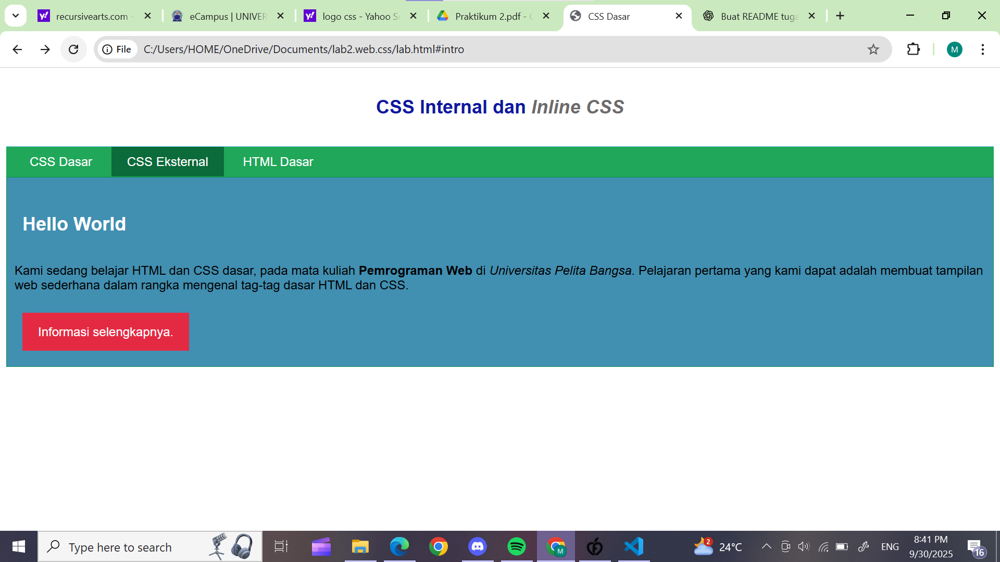
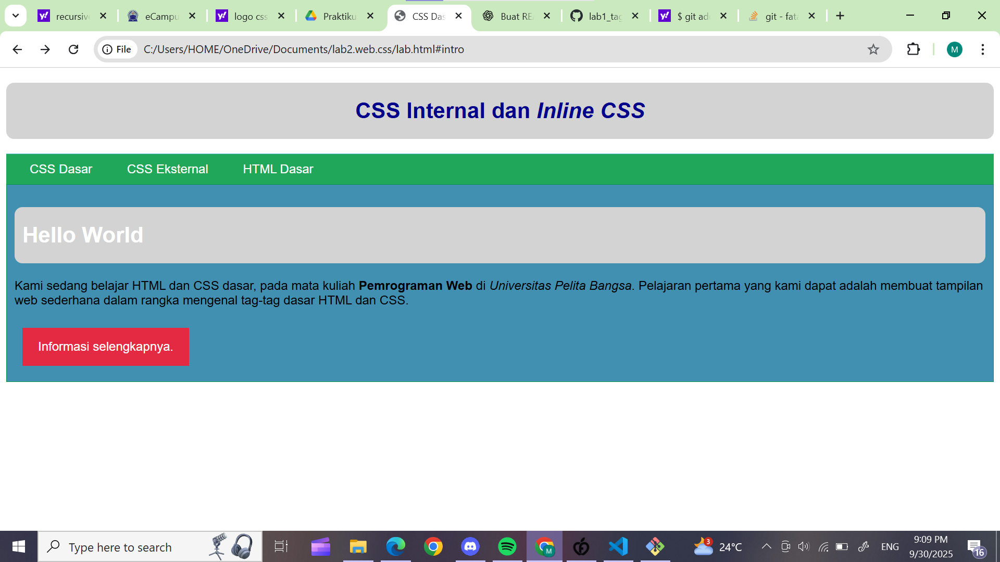
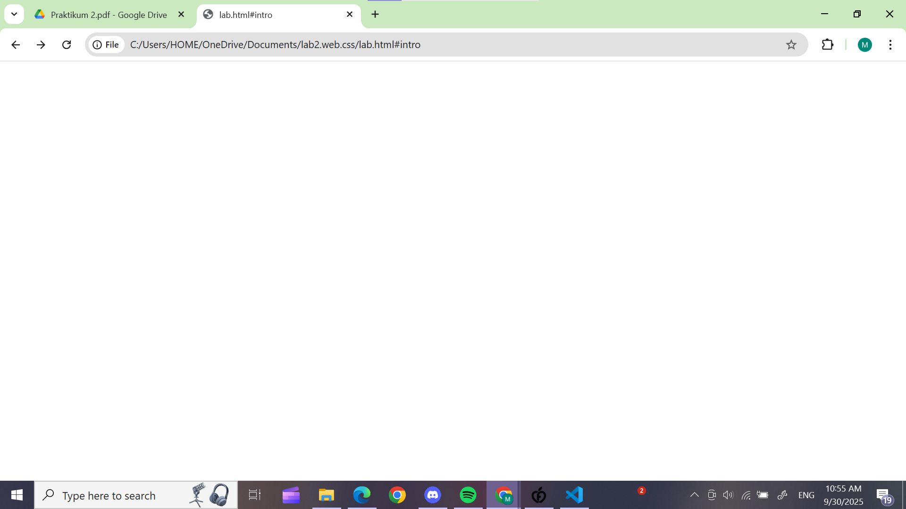

# 🌐 Praktikum 2: CSS Dasar

👤 **Nama**: Muhammad Aziz Tri Ramadhan

🆔 **NIM**: 312410380

🏫 **Kelas**: TI.24.A3

---

## 📂 File yang Digunakan

* 📄 **lab.html** → berisi struktur HTML utama serta deklarasi **internal CSS**.
* 🎨 **style_eksternal.css** → file CSS eksternal yang dipanggil dari `lab.html`.

---

## 🚀 Jawaban Tugas

### 🔹 1. Eksperimen Mengubah Properti CSS

Deklarasi awal pada elemen `<h1>` di `lab.html`:

```css
h1 {
  font-size: 24px;
  color: #0F189F;
  text-align: center;
  padding: 20px 10px;
}
```

📸 **Tampilan awal**: 

Kemudian saya ubah dengan menambahkan properti baru:

```css
h1 {
  font-size: 28px;
  color: darkblue;
  text-align: center;
  padding: 20px 10px;
  background-color: lightgray;
  border-radius: 10px;
}
```

📸 **Hasil perubahan**: 

✨ **Perubahan yang terlihat**:

* Ukuran teks lebih besar.
* Warna berubah menjadi biru tua.
* Ada latar belakang abu-abu dengan sudut melengkung.

---

### 🔹 2. Perbedaan `h1 {…}` dengan `#intro h1 {…}`

* `h1 {…}` → berlaku untuk **semua elemen `<h1>`**.
* `#intro h1 {…}` → hanya berlaku pada `<h1>` di dalam elemen dengan **id="intro"**.

📌 **Contoh kode**:

```html
<header>
  <h1>CSS Internal dan <i>Inline CSS</i></h1>
</header>

<div id="intro">
  <h1>Hello World</h1>
</div>
```

```css
h1 {
  color: red;
}
#intro h1 {
  color: green;
}
```

📸 **Hasil**: 

👉 **Kesimpulan**:

* Judul di `<header>` → **merah**.
* Judul di dalam `#intro` → **hijau**.

---

### 🔹 3. Prioritas CSS (Eksternal, Internal, Inline)

Urutan prioritas CSS:

1. **Inline CSS** (paling kuat 💪).
2. **Internal CSS** (dalam tag `<style>`).
3. **Eksternal CSS** (paling lemah jika konflik).

📌 **Contoh**:

```html
<p style="color: blue;">Teks ini Inline CSS</p>
```

```css
/* Internal */
p {
  color: green;
}

/* Eksternal */
p {
  color: red;
}
```

👉 **Hasil**: Teks tetap **biru**, karena inline CSS memiliki prioritas tertinggi.

---

### 🔹 4. Prioritas ID vs Class

Jika elemen memiliki **ID** dan **Class**, maka **ID lebih kuat**.

📌 **Contoh**:

```html
<p id="paragraf-1" class="text-paragraf">
  Ini contoh teks dengan ID dan Class
</p>
```

```css
.text-paragraf {
  color: blue;
}
#paragraf-1 {
  color: red;
}
```

👉 **Hasil**: Teks berwarna **merah**, karena selector **ID** lebih spesifik daripada **Class**.

---

## 📝 Kesimpulan

📌 Dari praktikum ini dapat disimpulkan bahwa:

1. CSS dapat memperindah tampilan web dengan berbagai properti.
2. Selector umum (`h1`) berbeda dengan selector spesifik (`#intro h1`).
3. Urutan prioritas CSS adalah: **Inline > Internal > Eksternal**.
4. **ID** memiliki tingkat prioritas lebih tinggi dibandingkan **Class**.

---

## 🛠️ Langkah-Langkah Praktikum

### 1️⃣ Tampilan Browser

📸

### 2️⃣ Membuat Dokumen HTML

📸

### 3️⃣ Mendeklarasikan CSS Internal

📸
📸

### 4️⃣ Eksperimen & Modifikasi

📸

